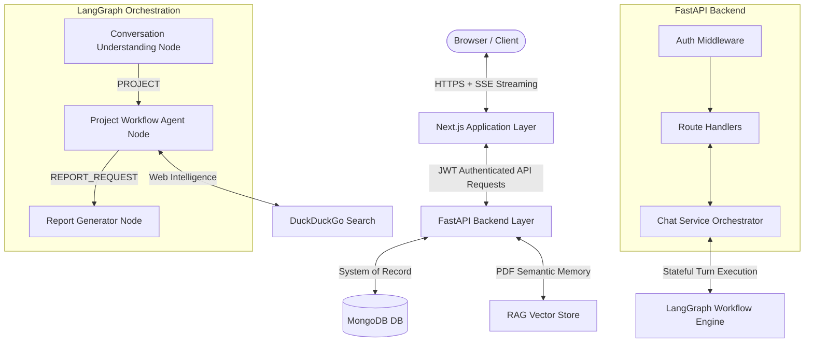

# ⚡ Planify

AI Project Intelligence Platform — turn ideas into structured plans, reports, and workspace artifacts through a connected frontend, API backend, and multi-agent workflow. Planify acts like a fused team of a **Product Manager** 🧑‍💼, **Business Analyst** 📊, **Solution Architect** 🏗️, and **Strategy Consultant** 🧠 operating over a persistent, multi-turn conversation.

---

## 🚀 Key Architectural Principles

1. 💾 **Statefulness**: Maintains a persistent, evolving understanding of "what this project is" across a long-lived conversation.
2. 🔗 **Interconnection**: Every generated artifact (PRD, Feasibility study, ROI model, Roadmap) is derived from a shared context object. Mutation of any assumption cascades and triggers re-derivation of dependent artifacts.
3. 🤖 **Multi-Agent Reasoning**: Coordinated via a LangGraph orchestration layer, specialized agents handle different domains (market research, technical feasibility, business strategy) rather than a single monolithic prompt.

---

## 🕸️ System Architecture & Request Lifecycle



### 🔄 Request Lifecycle Example (User sends message):
1. 💬 **User message sent**: The user sends a chat message (optionally with attachments) via the Next.js client.
2. 🔑 **API Verification**: Next.js proxies/forwards the request to FastAPI with a signed JWT. FastAPI's [auth.py](./backend/app/middleware/auth.py) middleware verifies the token signature independently and determines the user's role and workspace access.
3. 📥 **Context Ingestion**: The FastAPI route loads the latest project state and chat history from MongoDB.
4. 🧠 **LangGraph Execution**: FastAPI triggers the LangGraph workflow compiled in [graph.py](./backend/app/agent/graph.py).
   - [conversation_understanding.py](./backend/app/agent/nodes/conversation_understanding.py) decides if the turn is a `PROJECT` discussion or a general conversation query.
   - [project_workflow.py](./backend/app/agent/nodes/project_workflow.py) parses the user's answers and uses structured LLM calls to update the Project Context.
   - [report_generator.py](./backend/app/agent/nodes/report_generator.py) runs conditionally to synthesize detailed markdown reports based on the accumulated project knowledge.
5. 📡 **Streaming Response**: The response is saved to MongoDB and streamed in real-time to the client using Server-Sent Events (SSE).

---

## 📁 Repository Structure

Below is the high-level layout of the Planify repository:

```
Planify/
├── 📁 backend/                       # FastAPI Backend
│   ├── 📁 app/
│   │   ├── 📁 agent/                 # LangGraph Agent Workflow
│   │   │   ├── 📁 nodes/             # Agent nodes (Conversation, Project, Reports)
│   │   │   ├── 📁 rag/               # RAG Vector Store and PDF indexing
│   │   │   ├── 📄 graph.py           # LangGraph StateGraph compiler
│   │   │   ├── 📄 schemas.py         # Pydantic structured output models
│   │   │   ├── 📄 state.py           # Shared LangGraph WorkflowState definition
│   │   │   └── 📄 workflow_guards.py # Deterministic validations on agent output
│   │   ├── 📁 db/                    # Async MongoDB interface
│   │   ├── 📁 middleware/            # Security and JWT token verification
│   │   ├── 📁 routes/                # HTTP & SSE endpoint routers
│   │   ├── 📁 schemas/               # API validation models
│   │   ├── 📁 services/              # Business logic (chat, file, context services)
│   │   ├── 📁 utils/                 # MongoDB ObjectID validation
│   │   └── 📄 main.py                # FastAPI Application setup
│   └── 📄 pyproject.toml             # Python dependencies (uv managed)
│
├── 📁 frontend/                      # Next.js 15 Frontend
│   ├── 📁 app/                       # App Router Pages
│   │   ├── 📁 (auth)/                # Auth views (login, signup, password-reset)
│   │   ├── 📁 (root)/                # Landing/Marketing views
│   │   ├── 📁 dashboard/             # Workspace & Project selection dashboard
│   │   └── 📁 projects/[id]/         # Project layout containing chat & reports
│   ├── 📁 components/                # React UI Components
│   │   ├── 📁 auth/                  # Authentication forms and shells
│   │   ├── 📁 dashboard/             # Projects, Assets, and Settings components
│   │   ├── 📁 reports/               # Custom Markdown viewer panels per report type
│   │   └── 📁 workspace/             # Chat composer, agents drawer, clarification panel
│   ├── 📁 hooks/                     # Custom hooks (e.g. Chat scrolling logic)
│   ├── 📁 lib/                       # NextAuth, API client helper, crypto functions
│   └── 📄 package.json               # Node.js dependencies
│
├── 📁 graphify-out/                  # Architecture graph database
│   ├── 📄 GRAPH_REPORT.md            # Structural report on file connections
│   ├── 📄 graph.html                 # Interactive graph browser
│   └── 📄 graph.json                 # Parsed AST graph payload
│
├── 📄 phase.md                       # Comprehensive delivery schedule & phases
├── 📄 plan.md                        # Product & Architecture blueprint
└── 📄 readme.md                      # Primary project readme (this file)
```

---

## 📦 Key Directory Details

### ⚙️ FastAPI Backend (`backend/`)
* **📄 [main.py](./backend/app/main.py)**: Configures the FastAPI app, registers routes, and enables CORS and lifespan hooks.
* **🧠 [agent/](./backend/app/agent/)**: Configures the LangGraph engine.
  * **📄 [state.py](./backend/app/agent/state.py)**: Defines `WorkflowState` - the single source of truth passed between every node in the graph (including context, uploaded files, and message history).
  * **📄 [schemas.py](./backend/app/agent/schemas.py)**: Holds Pydantic models for LLM structured output.
  * **📄 [workflow_guards.py](./backend/app/agent/workflow_guards.py)**: Applies deterministic business logic (e.g. enforcing discovery criteria, stripping repetitive questions, normalizing budget parameters) to LLM responses.
* **🛣️ [routes/](./backend/app/routes/)**: Exposes REST and streaming SSE endpoints:
  * 🔑 [auth.py](./backend/app/routes/auth.py): Signup and user authentication callbacks.
  * 📁 [projects.py](./backend/app/routes/projects.py): Project lifecycle operations.
  * 💬 [chat.py](./backend/app/routes/chat.py): Chat message routing and turn-stream orchestration.
  * 📄 [reports.py](./backend/app/routes/reports.py): Querying and exporting generated artifacts.
* **🧱 [services/](./backend/app/services/)**:
  * ⚙️ [chat_service.py](./backend/app/services/chat_service.py): Manages LangGraph turn lifecycle, transaction locking, and SSE formatting.
  * 📁 [file_service.py](./backend/app/services/file_service.py): Handles RAG indexing and file ingestion.

### 🎨 Next.js Frontend (`frontend/`)
* **🧭 [app/](./frontend/app/)**: Uses the Next.js App Router.
  * 💬 [projects/\[id\]/chat/page.tsx](./frontend/app/projects/[id]/chat/page.tsx): Main interactive workspace page with custom sidebar for agent phases and dynamic chat threads.
  * 📄 [projects/\[id\]/reports/page.tsx](./frontend/app/projects/[id]/reports/page.tsx): Dynamic viewer showcasing compiled reports (PRD, Feasibility, ROI, Roadmap).
* **🧩 [components/](./frontend/components/)**:
  * 🖥️ [ProjectsView.tsx](./frontend/components/dashboard/ProjectsView.tsx): Project catalog dashboard with filters, search, and creation forms.
  * ❓ [WorkspaceClarificationPanel.tsx](./frontend/components/workspace/WorkspaceClarificationPanel.tsx): Renders structured clarification questions flagged by the backend agent.
* **📚 [lib/](./frontend/lib/)**:
  * 📡 [api.ts](./frontend/lib/api.ts): Encapsulates requests to the FastAPI backend, featuring SSE event-stream consumption (`apiStream`).
  * 🔐 [auth.ts](./frontend/lib/auth.ts): NextAuth authentication handlers, connecting to MongoDB for credentials and session verification.

---

## 🛠️ Getting Started

### 📋 Prerequisites
- **Python 3.11+** (managed via `uv`)
- **Node.js 18+**
- **MongoDB** (Local instance or MongoDB Atlas)
- **Ollama** running locally (or configured Gemini/Mistral API keys)

### 🗄️ 1. Database Setup
Ensure MongoDB is running locally on `mongodb://localhost:27017` or obtain a MongoDB Atlas URI string.

### 🐍 2. Backend Setup
1. Navigate to the backend directory:
   ```bash
   cd backend
   ```
2. Copy the environment variables template and configure it:
   ```bash
   cp .env.example .env
   # Edit backend/.env to configure MONGO_URI, JWT_SECRET, LLM_API_KEY, or OLLAMA_MODEL
   ```
3. Synchronize dependencies using `uv`:
   ```bash
   uv sync
   ```
4. Run the development server:
   ```bash
   uv run uvicorn app.main:app --reload --host 0.0.0.0 --port 8000
   ```
The Swagger documentation will be available at [http://localhost:8000/docs](http://localhost:8000/docs).

### 🖥️ 3. Frontend Setup
1. Navigate to the frontend directory:
   ```bash
   cd frontend
   ```
2. Copy the environment variables template and configure it:
   ```bash
   cp .env.example .env.local
   # Edit frontend/.env.local with NEXTAUTH_SECRET, NEXT_PUBLIC_API_URL, and MONGODB_URI
   ```
3. Install dependencies:
   ```bash
   npm install
   ```
4. Run the development server:
   ```bash
   npm run dev
   ```
Open [http://localhost:3000](http://localhost:3000) to view the application interface.

---

## 📊 Exploring Codebase Architecture (Graphify)

This repository includes a pre-compiled AST knowledge graph representing references, calls, and imports across all source files.

To explore this map in your browser:
```bash
open graphify-out/graph.html
```

If you modify codebase logic and want to rebuild the AST graph:
```bash
graphify update .
```

*For more information on repository structure, query options, and code connections, see [graphify-out/GRAPH_REPORT.md](./graphify-out/GRAPH_REPORT.md).*
